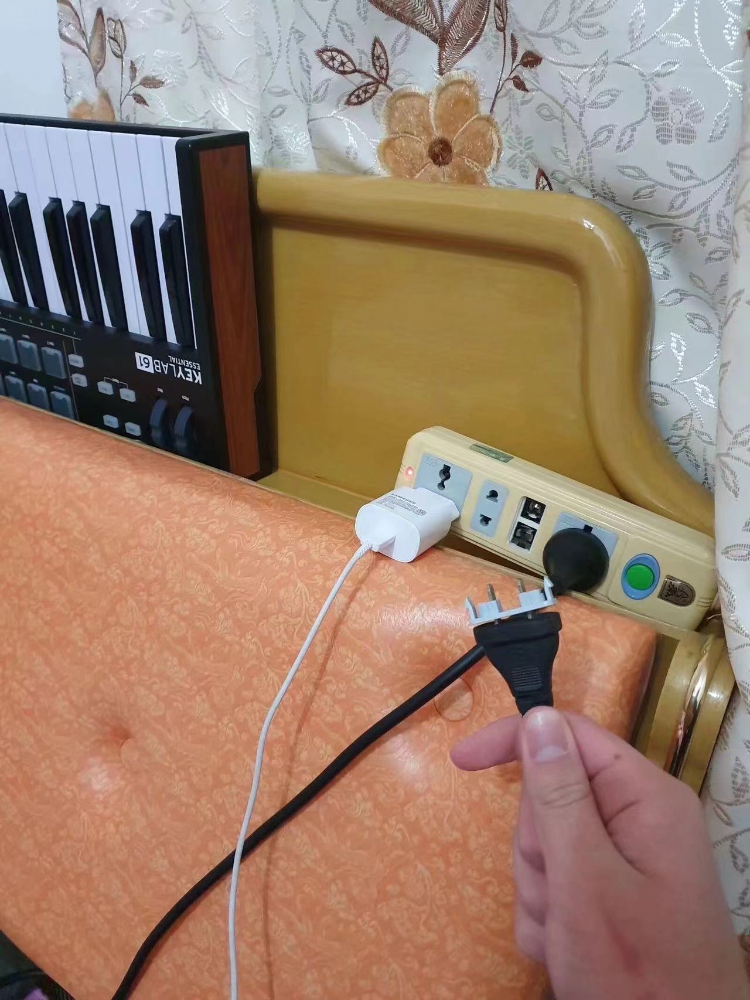
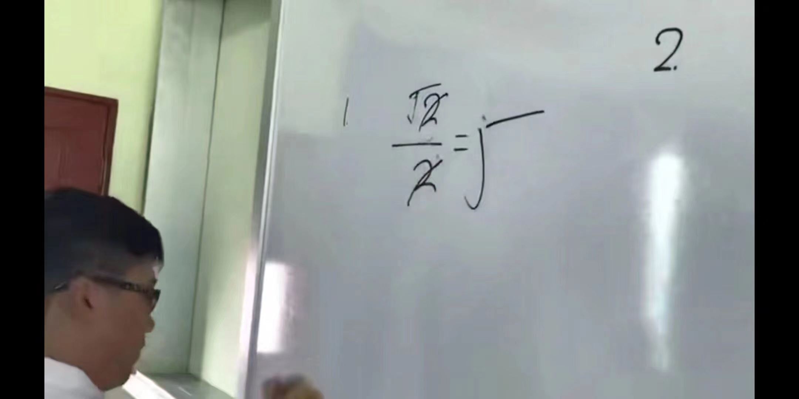
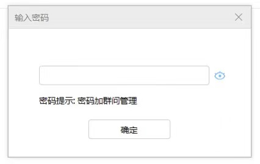

# # 1 - 20

## # 20

!!! quote inline end "2020 年 02 月 02 日 ｜ 只言"

？

---

## # 19

!!! quote inline end "2020 年 01 月 30 日 ｜ 只言"
（我只是用来保持宽度的占位元素）

过安检时安检姐姐一直拦着我不让我上地铁，我问她为什么，她说食物不能带上地铁，我说我没带食物。

然后她问我干什么的，我说我是编曲人，她说好家伙，原来你是编曲人！！！难怪我从你身上闻到了菜的味道！好菜！！！真的是好菜啊！！！

---

## # 18

!!! quote inline end "2020 年 01 月 25 日 ｜ 只言"

终于到了啥也不干在家躺着就能给社会做贡献的时候了。

---

## # 17

!!! quote inline end "2020 年 01 月 04 日 ｜ 只言"

我只是漫无目的地在避难所里转圈，  
就像一个老人回到他童年时生活的小镇。

---

## # 16

!!! quote inline end "2019 年 12 月 25 日 ｜ 只言"

---

## # 15

如图

!!! quote inline end "2019 年 12 月 14 日 ｜ 只言"

---

## # 14

!!! quote inline end "2019 年 12 月 10 日 ｜ 只言"

天才！

---

## # 13

!!! quote inline end "2019 年 12 月 14 日 ｜ 只言"

入群密码，加群问管理是吧

---

## # 12

!!! quote inline end "2019 年 12 月 05 日 ｜ 只言"

一晨一夜一人生，  
一生一世一蜉蝣。

🎦 [33.蜉蝣-1_哔哩哔哩_bilibili](https://www.bilibili.com/video/BV11s411i79q/?p=33)

---

## # 11

!!! quote inline end "2019 年 12 月 01 日 ｜ 只言"

我只是漫无目的地在避难所里转圈，  
就像一个老人回到他童年时生活的小镇。

---

## # 10

!!! quote inline end "2019 年 11 月 24 日 ｜ 只言"

---

## # 9

!!! quote inline end "2019 年 11 月 22 日 ｜ 只言"

聚光灯熄灭了，  
演员和观众都散了场  
我偷偷留在撒满金纸屑的舞台上，  
孤独而可耻的爱着对方。

---

## # 8

!!! quote inline end "2019 年 11 月 10 日 ｜ 只言"

---

## # 7

!!! quote inline end "2019 年 11 月 08 日 ｜ 只言"

推开门  
往事蝴蝶般  
扑面而来

即使失去现实  
也迷失在  
美好的心酸里  
手忙脚乱

---

## # 6

!!! quote inline end "2019 年 10 月 01 日 ｜ 只言"

千纸鹤，鹤千只，千只纸鹤寄相思；  
万夜书，书万页，万页夜书筹寂寞。

---

## # 5

!!! quote inline end "2019 年 09 月 25 日 ｜ 只言"

---

## # 4

!!! quote inline end "2019 年 09 月 17 日 ｜ 只言"

---

## # 3

!!! quote inline end "2019 年 07 月 2 日 ｜ 只言"

---

## # 2

!!! quote inline end "2019 年 06 月 18 日 ｜ 只言"

草

---

## # 1

!!! quote inline end "2019 年 04 月 22 日 ｜ 只言"

404 Not Found

---

__*Fin.*__